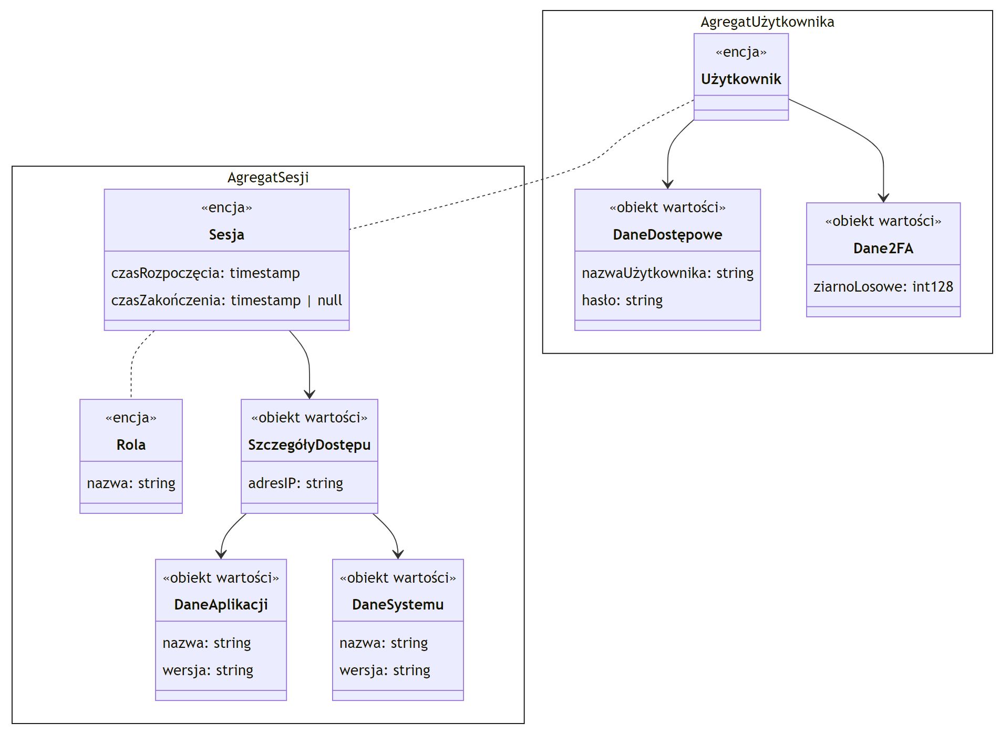
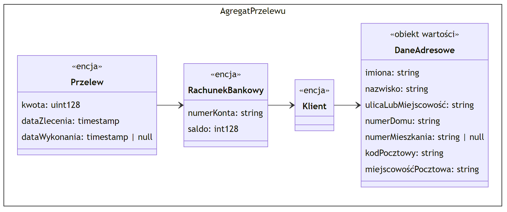
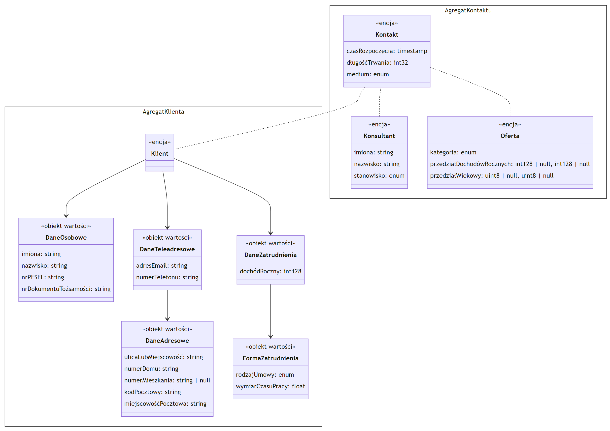

# Bezpieczna aplikacja bankowa

Zadanie polegało na zamodelowaniu wybranego fragmentu bezpiecznej aplikacji bankowej, korzystając z zasad Domain Driven Design. W swoim projekcie skupiłem się na trzech kontekstach: [uwierzytelnianiu](#kontekst-uwierzytelnianie), [przelewach](#kontekst-przelewy) oraz [marketingu](#kontekst-marketing), w każdym z nich modelując pewną minimalną liczbę encji z podstawowymi danymi zawartymi w obiektach wartości. Poziom granulacji obiektów wartości jest umiarkowany, np. traktuję adres jako pojedynczy obiekt wartości składający się z typów prymitywnych zamiast wydzielać dodatkowe obiekty takie jak: Miasto, Ulica, KodPocztowy.

## Model

### Kontekst: uwierzytelnianie

### Kontekst: przelewy

### Kontekst: marketing

## Przyjęte założenia

Atrybuty encji i obiektów wartości zostały wyszczegółowione w diagramie. Zakłada się, że encje mają swój unikalny identyfikator. Obiekty wartości porównywane są po wartości atrybutów składowych.

Wszystkie konteksty łączy przenika obiekt klienta/użytkownika, interpretowany na różne sposoby, ale mimo to mogący być identyfikowany za pomocą tego samego identyfikatora:

- [uwierzytelnianie](#kontekst-uwierzytelnianie): Użytkownik,
- [przelewy](#kontekst-przelewy): Klient,
- [marketing](#kontekst-marketing): Klient.

Typy atrybutów podane są po dwukropku. Format następujących atrybutów wymaga doprecyzowania:

- [marketing](#kontekst-marketing)/AgregatKlienta/FormaZatrudnienia/rodzajUmowy: enum (lub słownik) może obejmować takie wartości jak umowa o pracę, umowa-zlecenie, umowa o dzieło,
- [marketing](#kontekst-marketing)/AgregatKlienta/FormaZatrudnienia/wymiarCzasuPracy: wartość w zakresie `(0; 1]`,
- [marketing](#kontekst-marketing)/AgregatKontaktu/Kontakt/długośćTrwania: wartość wyrażona w sekundach,
- [marketing](#kontekst-marketing)/AgregatKontaktu/Kontakt/medium: dozwolone wartości to m.in. rozmowa telefoniczna, rozmowa osobista, konwersacja z użyciem poczty elektronicznej, konwersacja z użyciem komunikatora błyskawicznego,
- [marketing](#kontekst-marketing)/AgregatKontaktu/Konsultant/stanowisko: dozwolone wartości odpowiadają nazwom stanowisk konsultanckich w banku,
- [marketing](#kontekst-marketing)/AgregatKontaktu/Oferta/kategoria: przykładowe dozwolone wartości to kredyt gotówkowy, kredyt hipoteczny, karta kredytowa, lokata.

Wyrażeniem regularnym `^[a-zA-Z0-9 _-]{1,64}$` powinny być weryfikowane wszystkie atrybuty typu `string` z wyjątkiem:

- [uwierzytelnianie](#kontekst-uwierzytelnianie)/AgregatSesji/SzczegółyDostępu/adresIP: format adresu IPv4 lub IPv6,
- [uwierzytelnianie](#kontekst-uwierzytelnianie)/AgregatSesji/DaneAplikacji/wersja: format semver,
- [uwierzytelnianie](#kontekst-uwierzytelnianie)/AgregatUżytkownika/DaneDostępowe/hasło: `^[a-zA-Z0-9 =_+!@#$%^&*()-]{8,64}$`,
- [przelewy](#kontekst-przelewy)/AgregatPrzelewu/RachunekBankowy/numerKonta: `^[0-9]{26}$`,
- [przelewy](#kontekst-przelewy)/AgregatPrzelewu/DaneAdresowe/kodPocztowy: `^[0-9]{5}$`,
- [marketing](#kontekst-marketing)/AgregatKlienta/DaneOsobowe/nrPESEL: `^[0-9]{11}$`,
- [marketing](#kontekst-marketing)/AgregatKlienta/DaneOsobowe/nrDokumentuTożsamości: `^[A-Z0-9/]{9,64}$`,
- [marketing](#kontekst-marketing)/AgregatKlienta/DaneTeleadresowe/adresEmail: format adresu e-mail,
- [marketing](#kontekst-marketing)/AgregatKlienta/DaneTeleadresowe/numerTelefonu: format numeru telefonicznego,
- [marketing](#kontekst-marketing)/AgregatKlienta/DaneAdresowe/kodPocztowy: `^[0-9]{5}$`.

Warto nadmienić, iż:

- typ `timestamp` oznacza wartość czasową podaną z dokładnością do milisekundy,
- symbol `|` wyraża alternatywę,
- typ `null` symbolizuje wartość pustą,
- typy rozdzielone przecinkiem tworzą krotkę.
