# Analiza podatności w aplikacji Flask_Book_Library

Wszelkie wnioski wyciągnięte zostały na podstawie korzystania z aplikacji w roli użytkownika oraz analizy dostępnego API, kodu HTML i JavaScript.

## Podatność XSS

### Strona Books

1. Wyszukiwarka nie jest podatna, ponieważ filtrowanie odbywa się w sposób dynamiczny, wyłącznie po stronie klienta. Strona nie umieszcza zawartości filtra np. w zapytaniu HTTP GET, co uniemożliwia zastosowanie ataku typu Reflected XSS.
2. Format wszystkich 4 pól definiujących pozycję książkową (Name, Author, Year Published i Type) sprawdzany jest wyłącznie po stronie użytkownika. Umożliwia to zapisanie dowolnych danych po stronie serwerowej. Potwierdzenie stanowi wiadomość w formacie JSON otrzymywana po kliknięciu przycisku Edit na utworzonym wpisie.  
   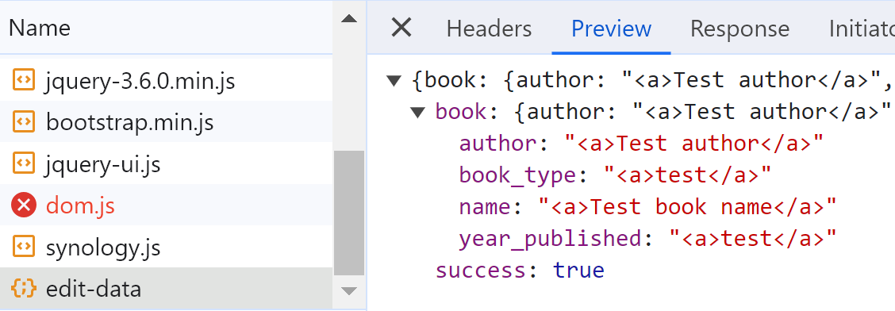
3. Zawartość pierwszych dwóch pól (Name, Author) jest umieszczana w kodzie HTML bez żadnych środków ochronnych. Umożliwiają zatem atak typu Stored XSS. Kolejne dwa pola (Year Published, Type) wykorzystują sekwencje ucieczki do kodowania znaków specjalnych HTML.  
   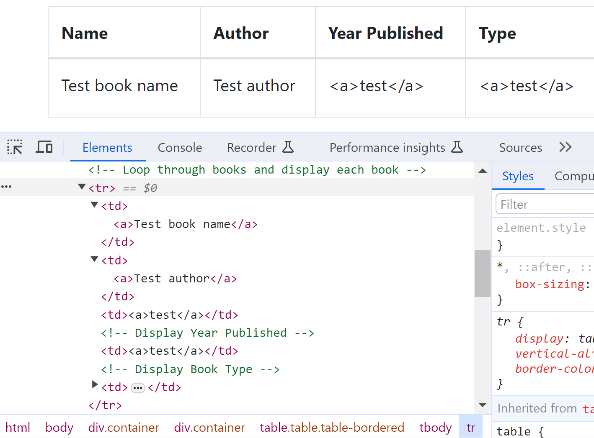
4. Przykład wykonania skryptu w omówionych polach:  
   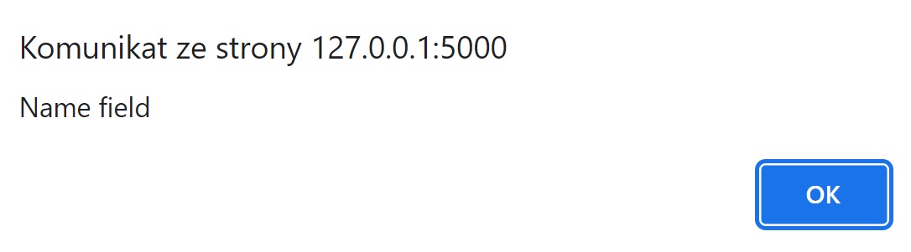  
   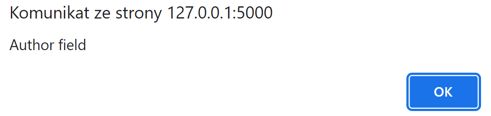  
   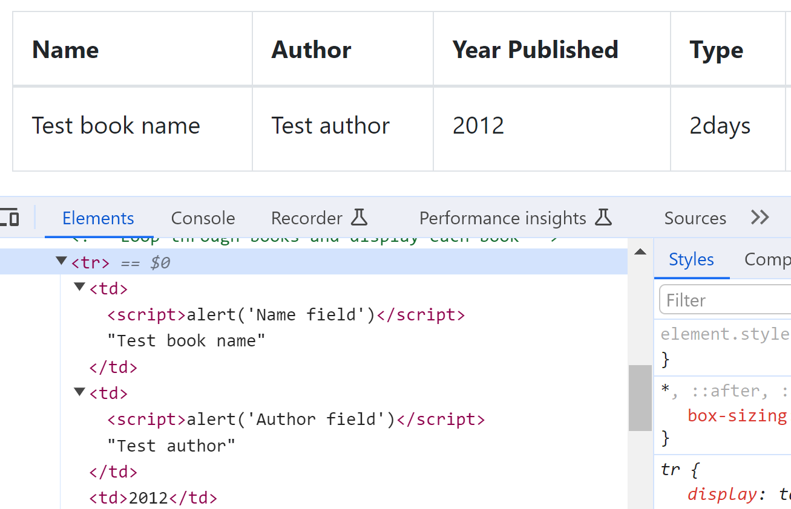

### Strona Customers

1. Analogicznie jak na stronie Books, wyszukiwarka nie jest podatna.
2. Analogicznie jak na stronie Books, API przyjmuje dowolne wartości dla 3 pól (Name, City, Age).  
   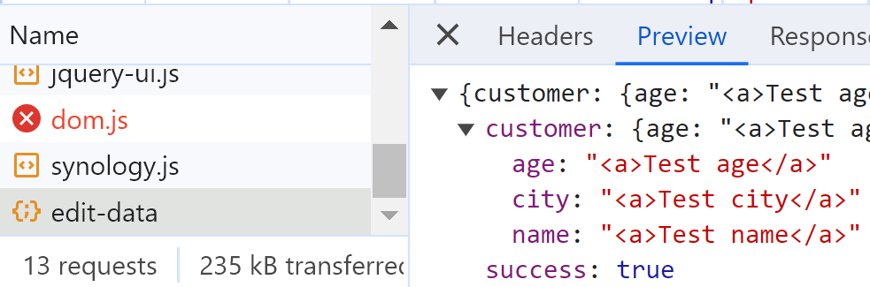
3. Analogicznie jak na stronie Books, znaki specjalne w dwóch pierwszych polach (Name, City) nie są zamieniane w sekwencje ucieczki, a w przypadku ostatniego pola (Age) już tak. Możliwy jest atak Stored XSS.  
   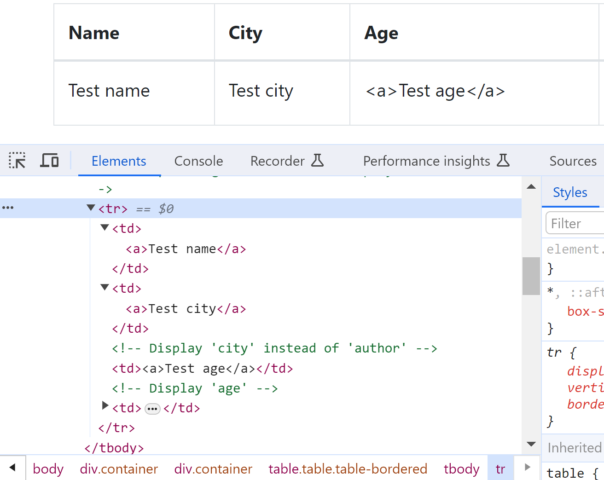
4. Przykład wykonania skryptu w omówionych polach:  
   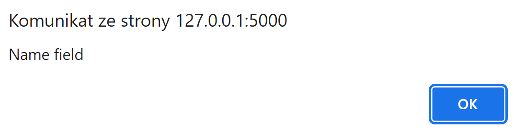  
   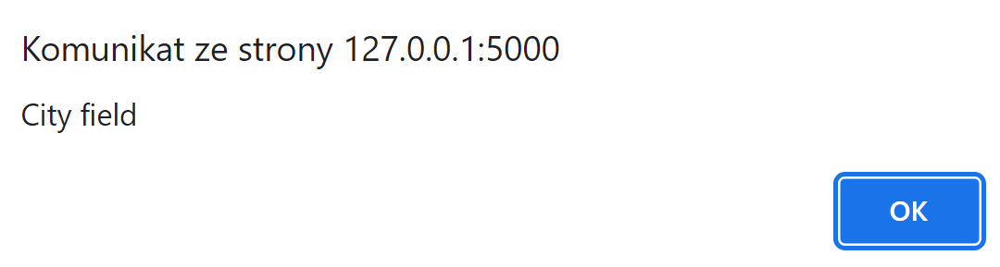  
   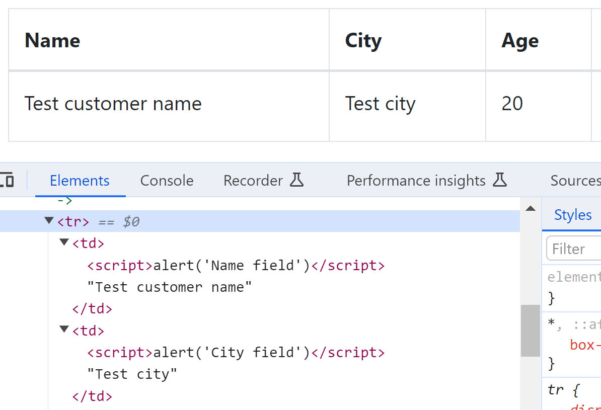

### Strona Loans

1. Analogicznie jak na stronach Books i Customers, wyszukiwarka nie jest podatna.
2. Nie jest podatny również formularz wypożyczania, w którym wyświetlane są imię klienta oraz nazwa książki (Customer Name, Book Name). Znaki specjalne zamieniane są na sekwencje ucieczki.  
   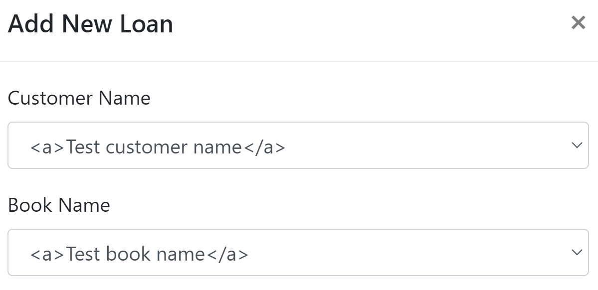
3. Spośród 4 pól formularza weryfikowane są wszystkie za wyjątkiem Customer Name, któremu można nadać dowolną (również nieistniejącą) wartość. Próba nadania nieistniejącej (lub już "wypożyczonej") wartości polu Book Name kończy się błędem `{"error":"Book not available for loan."}`. Podanie nieprawidłowej daty również kończy się błędem (więcej o błędzie napisane jest [niżej](#strona-loans---brak-sprawdzenia-zależności-między-datami)).
4. Treść pól Customer Name oraz Book Name w widoku listy wypożyczeń nie ma znaków specjalnych zamienionych na sekwencje ucieczki, co umożliwia atak Stored XSS.  
   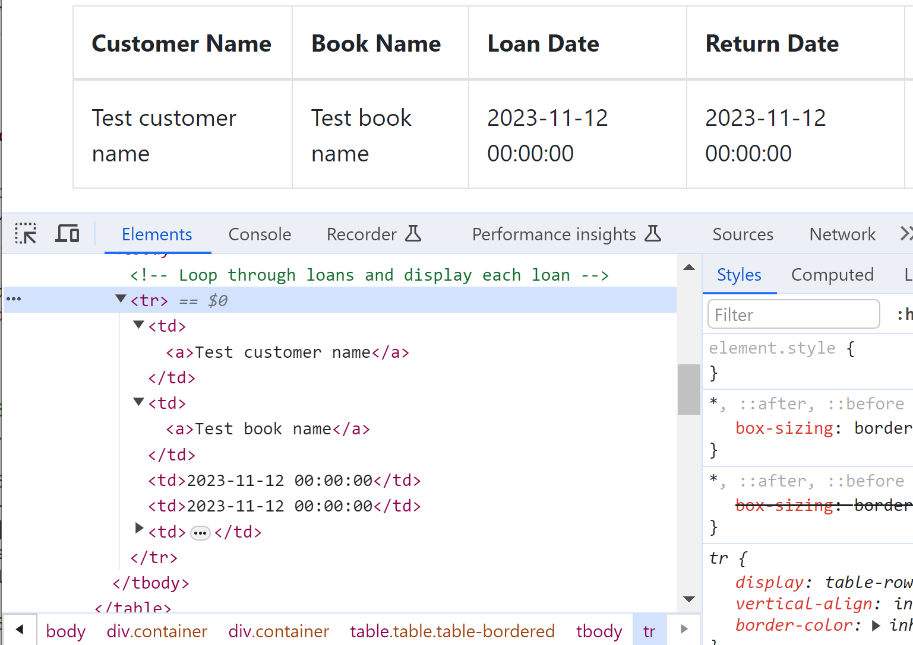
5. Przykład wykonania skryptu w omówionych polach:  
   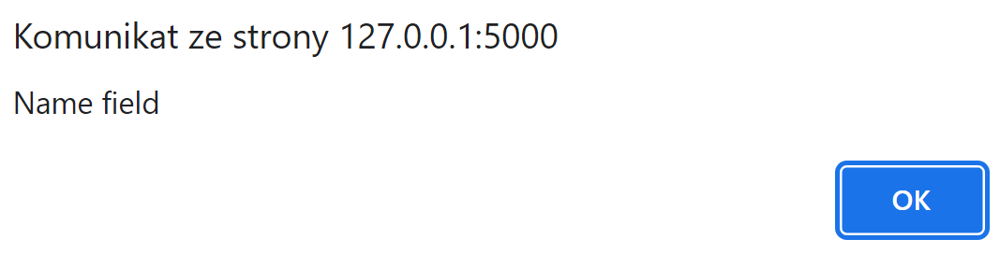  
   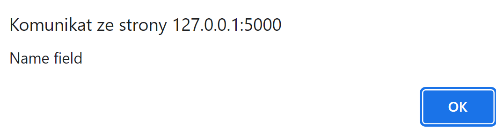  
   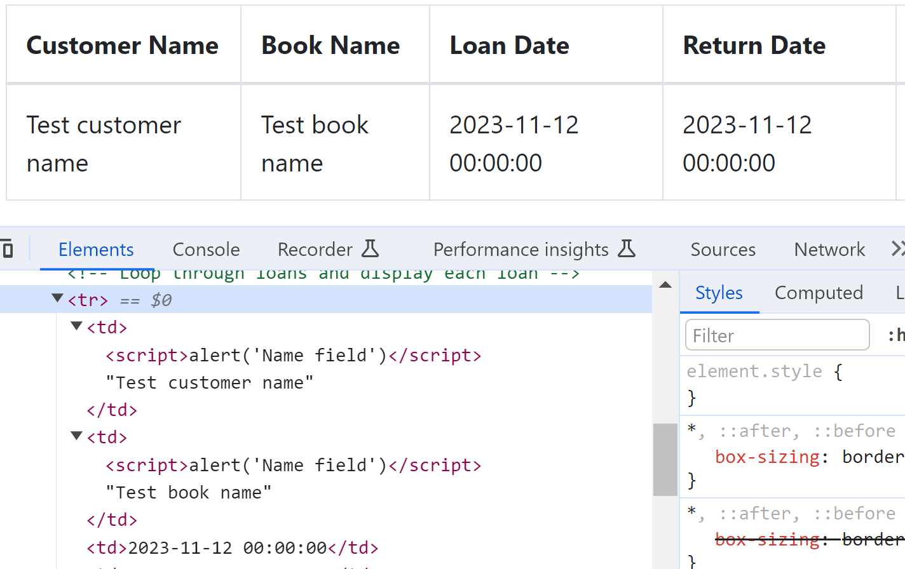

## Inne błędy w prezentacji lub logice aplikacji

### Strona Loans - możliwość odczytu szablonu kwerendy

Usunięcie weryfikacji niepustości daty wypożyczenia i zwrotu książki (Load Date, Return Date) w formularzu tworzenia informacji o wypożyczeniu powoduje naruszenie zasad integralności bazy danych i wyświetlenia komunikatu:

```json
{"error":"Error creating loan: (sqlite3.IntegrityError) NOT NULL constraint failed: Loans.loan_date\n[SQL: INSERT INTO \"Loans\" (customer_name, book_name, loan_date, return_date, original_author, original_year_published, original_book_type) VALUES (?, ?, ?, ?, ?, ?, ?)]\n[parameters: ('', '', None, None, '', '', '')]\n(Background on this error at: https://sqlalche.me/e/20/gkpj)"}
```

### Strona Loans - brak sprawdzenia zależności między datami

Wartość Return Date może zawierać datę poprzedzającą Loan Date. Pod uwagę nie jest też brana możliwa długość wypożyczenia danej książki (Type).
